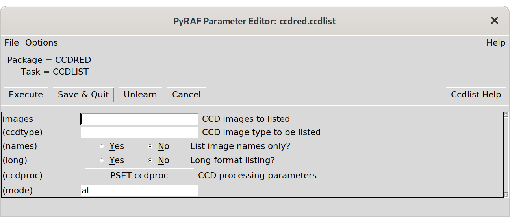
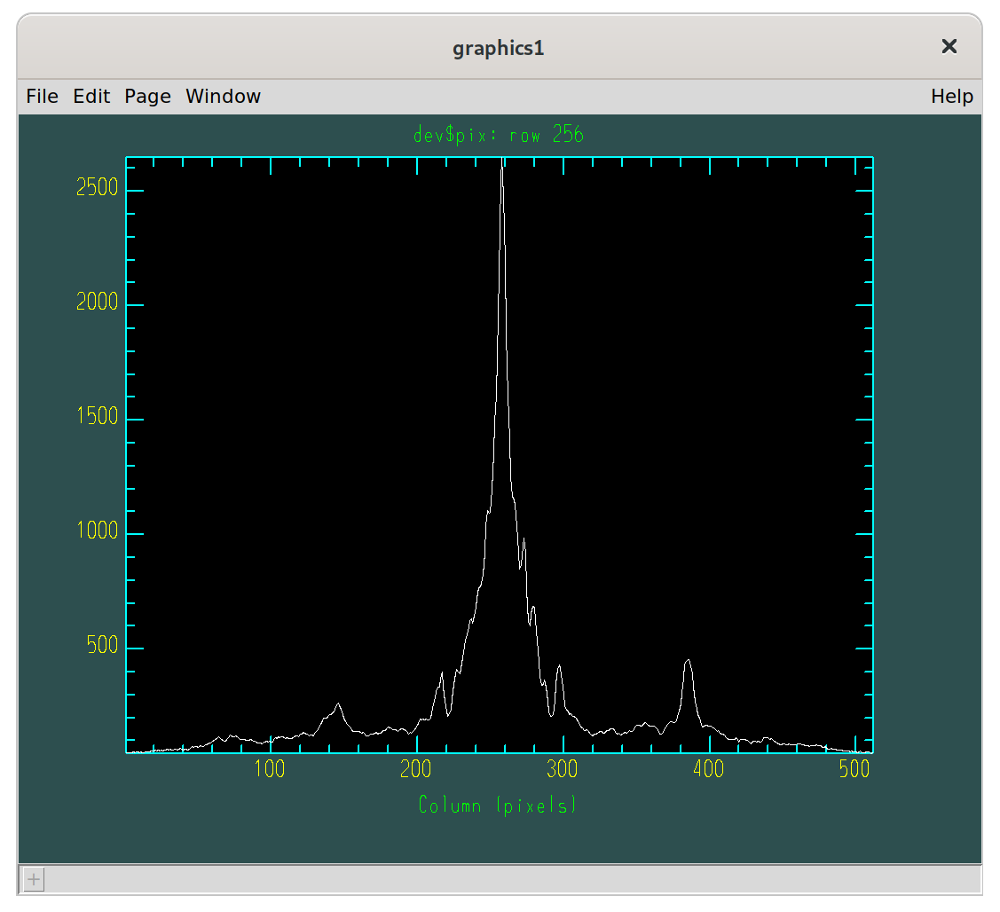

******************
The PyRAF Tutorial
******************
:Authors: - Richard L. White
	  - Perry Greenfield
	  - Ole Streicher
:Abstract: PyRAF, based on the Python scripting language, is a command
  language for IRAF that can be used in place of the existing
  IRAF CL. This document provides a tutorial introduction to the PyRAF
  system, showing how it can be used to run IRAF tasks. It describes
  how to run IRAF tasks using either the familiar IRAF syntax or
  Python syntax. It also describes PyRAF’s graphical parameter editor
  and the graphics system.

Introduction
============

Why a New IRAF CL?
------------------

The IRAF_ CL has some shortcomings as a scripting language that
make it difficult to use in writing scripts, particularly complex
scripts. The major problem is that the IRAF CL has no error or
exception handling. If an error occurs, the script halts immediately
with an error message that has little or no information about where
the error occurred. This makes it difficult to debug scripts,
impossible to program around errors that can be anticipated, and
difficult to provide useful error messages to the user.

But there are other important reasons for wanting to replace
the CL. We want to use a command language that is a stronger
environment for general programming and that provides more tools than
the existing IRAF CL. Python_ is a free, popular scripting language
that is useful for a very wide range of applications (e.g., scientific
analysis, text processing, file manipulation, graphical programming,
etc.). Python is also an open system that can be easily extended by
writing new modules in Python, C, or Fortran. By developing a Python
interface to IRAF tasks, we open up the IRAF system and make it
possible to write scripts that combine IRAF tasks with the numerous
other capabilities of Python.

Why Should I Use PyRAF?
-----------------------

PyRAF can run the vast majority of IRAF tasks without any
problems. You can display graphics and use interactive graphics and
image display tasks as well. You can even run almost all IRAF CL
scripts! While many things work the same way as they do in the IRAF
CL, there are some differences in how things are done, usually for the
better.

The most important difference between PyRAF and the old IRAF CL is
that PyRAF allows you to write scripts using a much more powerful
language that has capabilities far beyond simply running IRAF
tasks. Some of the things that now become possible are:

* Easier script debugging.

* Ability to trap errors and exceptions.

* Access to all the features of Python including:

  - built-in list (array) and dictionary (hash table) data structures

  - extensive string handling libraries

  - GUI libraries that make it straightforward to wrap IRAF tasks with
    GUI interfaces

  - web and networking libraries making it easy to generate html, send
    email, handle cgi requests, etc.

* Simple access to other software packages written in C or Fortran.

* Ability to read and manipulate FITS files and tables using astropy
  and numpy.

As far as the interactive environment goes, the new system has most of
the current features and conveniences of the IRAF CL as well as a
number of new features. It is possible to use exactly the same
familiar IRAF CL syntax to run IRAF tasks (e.g., ``imhead dev$pix
long+``). There are some additional features such as command-history
recall and editing using the arrow keys, tab-completion of commands
and filenames, a GUI equivalent to the epar parameter editor, the
ability to display help in a separate window, and a variety of tools
for manipulation of graphics. We believe the new environment is
in many ways more convenient for interactive use than the IRAF CL.

Prerequisites
-------------

This guide will not attempt to serve as a Python introduction,
tutorial or guide. There are a number of other documents that serve
that role well. At some point we recommend spending a few hours
familiarizing yourself with Python basics. Which Python documentation
or books to start with depends on your programming background and
preferences.  Some people will find quick introductions like the
`Python tutorial`_ all they need.  In any case, do not spend too much
time reading before actually starting to run PyRAF and use Python. The
Python environment is an interactive one and one can learn quite a bit
by just trying different things after a short bit of reading.  In
fact, you may prefer to try many of the examples given in this guide
before reading even a single Python document.  We will give enough
information for you to get started in trying the examples. Our
approach will be largely based on examples.

This guide also is not intended to be an introduction to IRAF. We
assume that current PyRAF users are relatively experienced with
IRAF. Check the `Beginner’s Guide to Using IRAF`_ for an (outdated)
introduction.

Installation
============

To install PyRAF, it is required to have both IRAF_ and Python_
already installed. For the IRAF installation, it is recommended to use
a version from iraf-community_, as these include many bugs fixed for
current Linux and macOS versions and architectures. Both a
self-compiled and a binary IRAF package (f.e. in Ubuntu_) will work.

The IRAF installation should have a properly configured environment,
especially the ``iraf`` environment variable must be set to point to
the IRAF installation directory (i.e. to ``/usr/lib/iraf/`` on Ubuntu
or Debian systems). On multi-arch IRAF installations, the ``IRAFARCH``
environment variable should specify the architecture to use. This is
usually already set during the IRAF installation procedure.

The minimal Python required for PyRAF is 3.6, but it is recommended to
use the latest available version. An installation in an virtual
environment like venv_ or conda_ is possible.

On some Linux distributions, PyRAF is readily available as a binary
package and can be installed with the package installer, like ``sudo
apt install python3-pyraf`` on Debian or Ubuntu. On all other systems,
the package can be installed via PyPI_ with the command ``pip3 install
pyraf``. Note that if no binary installation is available on PyPI, the
package requires a compilation, so aside from pip3, the C compiler and
development libraries (on Linux ``libx11-dev``) should be installed.

Starting and Using PyRAF Interactively
======================================

If PyRAF is installed (and your environment is properly configured),
typing ``pyraf`` will start up PyRAF using the front-end
interpreter. (There are a few command line options, described in
:ref:`Command Line Options`, that can be listed using ``pyraf
--help``.) Here is an illustration of starting PyRAF and running some
IRAF tasks using the CL emulation syntax.

::

  $ pyraf
  NOAO/IRAF community V2.16.1+ snapshot Mon, 24 Aug 2021 10:27:34 +0000

  This product includes results achieved by the IRAF64 project in 2006-
  2009 directed by Chisato Yamauchi (C-SODA/ISAS/JAXA).

  Welcome to IRAF.  To list the available commands, type ? or ??.  To get
  detailed information about a command, type `help <command>'.  To run  a
  command  or  load  a  package,  type  its name.   Type  `bye' to exit a
  package, or `logout' to get out  of the CL.

  Visit http://github.com/iraf-community/iraf/issues to report problems.

  The following commands or packages are currently defined:
     …
  --> imheader dev$pix long+
  dev$pix[512,512][short]: m51 B 600s
  No bad pixels, min=-1., max=19936.
  Line storage mode, physdim [512,512], length of user area 1621 s.u.
  Created Mon 23:54:13 31-Mar-1997, Last modified Mon 23:54:14 31-Mar-1997
  Pixel file "HDR$pix.pix" [ok]
  ’KPNO-IRAF’           /
  ’31-03-97’            /
  IRAF-MAX=           1.993600E4 / DATA MAX
  IRAF-MIN=          -1.000000E0 / DATA MIN
  IRAF-BPX=                   16 / DATA BITS/PIXEL
  IRAFTYPE= ’SHORT’              / PIXEL TYPE
  CCDPICNO=                   53 / ORIGINAL CCD PICTURE NUMBER
     …
  HISTORY ’24-04-87’
  HISTORY ’KPNO-IRAF’            /
  HISTORY ’08-04-92’             /
  --> imstat dev$pix
  #               IMAGE      NPIX      MEAN    STDDEV       MIN       MAX
		dev$pix    262144     108.3     131.3       -1.    19936.
  --> imcopy dev$pix mycopy.fits
  dev$pix -> mycopy.fits

You may notice a great similarity between the PyRAF login banner and
the IRAF login banner. That’s because PyRAF reads your normal
:file:`login.cl` file and goes through exactly the same startup steps
as IRAF when a session begins. If you have customized your
:file:`login.cl` or :file:`loginuser.cl` files to load certain
packages, define tasks, etc., then those customizations will also take
effect in your PyRAF environment.

You can start up PyRAF from any directory; unlike the IRAF CL, you are
not required to change to your IRAF home directory. PyRAF determines
the location of your IRAF home directory by looking for your
:file:`login.cl` file, first in your current working directory and
then in a directory named :file:`iraf` in your home directory. So as
long as your IRAF home directory is :file:`~/iraf` or :file:`~/.iraf`,
you can start up PyRAF from any working directory. (You can start from
other directories as well, but without access to :file:`login.cl` your
IRAF environment will be only partly initialized. We expect to add a
startup configuration file, :file:`.pyrafrc`, that allows you
customize your initial PyRAF configuration including your IRAF home
directory.)

The first time you run PyRAF, it creates a :file:`pyraf` directory in
your IRAF home directory. All it stores there is a file named
:file:`clcache.sqlite3`, which is used to save translated versions of
your own custom CL scripts.

Note that the task syntax shown above is identical to that of the
IRAF CL. But there is no escaping that you are really running in a
Python environment. Should you make a mistake typing a task name, for
example,

::

  --> imstart dev$pix
    File "<console>", line 1
      imstart dev$pix
	      ^
  SyntaxError: invalid syntax

or should you use other CL-style commands,

::

  --> =cl.menus
    File "<console>", line 1
      =cl.menus
      ^
  SyntaxError: invalid syntax

then you’ll see a Python error message. At this stage, this is the
most likely error you will see aside from IRAF-related ones.

Aside from some noticeable delays (on startup, loading graphics
modules, or in translating CL scripts not previously encountered),
there should be little difference between running IRAF tasks in CL
emulation mode and running them in the IRAF CL itself.

New Capabilities in PyRAF
-------------------------

Several capabilities in the PyRAF interpreter make it very convenient
for interactive use. The up-arrow key can be used to recall previous
commands (no need to type ``ehis``!), and once recalled the left and
right arrow keys can be used to edit it. The :kbd:`Ctrl`-:kbd:`R` key
does pattern-matching on the history. Just type part of the command
(not necessarily at the beginning of the line) and you’ll see the
matched command echoed on the command line. Type :kbd:`Ctrl`-:kbd:`R`
again to see other matches. Hit return to re-execute a command, or
other line-editing keys (left/right arrow, :kbd:`Ctrl`-:kbd:`E`,
:kbd:`Ctrl`-:kbd:`A`, etc.) to edit the recalled command. There are
many other ways to search and manipulate the history – see the gnu
readline documentation for more information.

The tab key can be used to complete commands, in a way familiar to
users of tcsh and similar shells. At the start of the command line,
type ``imhe``:kbd:`Tab` and PyRAF fills in ``imheader``. Then type
part of a filename :kbd:`Tab` and PyRAF fills in the rest of the name
(or fills in the unambiguous parts and prints a list of
alternatives). This can be a great timesaver for those long HST
filenames! You can also use tab to complete IRAF task keyword names
(e.g., ``imheader lon``:kbd:`Tab` fills in ``longheader``, to which
you can add ``=yes`` or something similar). And when using Python
syntax (see below), tab can be used to complete Python variable names,
object attributes, etc.

The function

::

  saveToFile filename

saves the current state of your PyRAF session to a file (including
package, task, and IRAF environment variable definitions and the
current values of all task parameters). The function

::

  restoreFromFile filename

restores the state of your session from its previously saved state. A
save filename can also be given as a Unix command line argument when
starting up PyRAF, in which case PyRAF is initialized to the state
given in that file. This can be a very useful way both to start up in
just the state you want and to reduce the startup time.

Differences from the CL and Unimplemented CL Features
-----------------------------------------------------

Some differences in behavior between PyRAF and the CL are worth
noting. PyRAF uses its own interactive graphics kernel when the CL
``stdgraph`` variable is set to a device handled by the CL itself
(e.g., xgterm). If ``stdgraph`` is set to other values
(e.g. ``stdplot`` or the imd devices), the appropriate CL task is
called to create non-interactive plots. Only the default PyRAF
graphics window supports interactive graphics (so you can’t do
interactive graphics on image display plots, for example.) Graphics
output redirection is not implemented.

Some IRAF CL commands have the same names as Python commands; when you
use them in PyRAF, you get the Python version. The ones most likely to
be encountered by users are :func:`print` and :keyword:`del`. If
you want to use the IRAF print command (which should rarely be
needed), use ``clPrint`` instead. If you want the IRAF ``delete``
command, just type more of the command (either ``dele`` or ``delete``
will work).

Another similar conflict is that when an IRAF task name is identical
to a reserved keyword in Python (to see a list, do ``import keyword;
print(keyword.kwlist)``), then it is necessary to prepend a ``PY`` (yes,
in capital letters) to the IRAF task name. Such conflicts should be
relatively rare, but note that :keyword:`lambda` and :keyword:`in` are
both Python keywords.

The PyRAF help command is a little different than the IRAF version. If
given a string argument, it looks up the CL help and uses it if
available. For other Python argument types, ``help`` gives information
on the variable. E.g., ``help(module)`` gives information on the
contents of a module. There are some optional arguments that are
useful in Python programs (type ``help(help)`` for more
information).

If you need to access the standard IRAF help command without the
additional PyRAF features, use ``system.help taskname options``.  Note
that the IRAF help pages are taken directly from IRAF and do not
reflect the special characteristics of PyRAF.  For example, if you say
``help while``, you get help on the CL while loop rather than the
Python while statement.  The login message on startup also comes
directly from IRAF and may mention features not available (or
superseded) in PyRAF.

There are a few features of the CL environment and CL scripts that are
not yet implemented:

Packages cannot be unloaded.
  There is no way to unload a loaded IRAF package. The bye command
  exists but does not do anything; the keep command also does nothing
  (effectively all modifications to loaded tasks and IRAF environment
  variables are kept).

No GOTO statements in CL scripts.
  Python does not have a :keyword:`goto` statement, so converting CL
  scripts that use goto’s to Python is difficult. We have made no
  effort to do such a conversion, so CL scripts with GOTO’s raise
  exceptions. GOTOs may not ever get implemented.  Background
  execution is not available. Background execution in CL scripts is
  ignored.

Error tracebacks in CL scripts do not print CL line numbers.
  When errors occur in CL scripts, the error message and traceback
  refer to the line number in the Python translation of the CL code,
  not to the original CL code. (If you want to see the Python
  equivalent to a CL task, use the getCode method –
  e.g. ``print(iraf.spy.getCode())`` to see the code for the ``spy``
  task).

The EPAR Parameter Editor
=========================

For PyRAF we have written a task parameter editor that is similar to
the IRAF epar function but that uses a graphical user interface (GUI)
rather than a terminal-based interface. PyRAF’s EPAR has some features
not available in the IRAF CL, including a file browser for selecting
filename parameters and a pop-up window with help on the task.  Upon
being invoked in the usual manner in IRAF CL emulation mode, an EPAR
window for the named task appears on the screen:

::

  --> epar ccdlist

An EPAR window consists of a menu bar, current package and task
information, action buttons, the parameter editing panel, and a status
box. If there are more parameters than can fit in the displayed
window, they will appear in a scrolling region.

Action Buttons
--------------

The EPAR action buttons are:

Execute
  Execute the task with parameter values currently displayed in the
  EPAR windows. (Several windows may be open at once if the task has
  PSET parameters – see below.) If parameter values were changed and
  not saved (via the Save button), these new values are automatically
  verified and saved before the execution of the task. The EPAR window
  (and any child windows) is closed, and the EPAR session ends.

Save
  This button saves the parameter values associated with the current
  EPAR window. If the window is a child, the child EPAR window
  closes. If the window is the parent, the window closes and the EPAR
  session ends. The task is not executed.

Unlearn
  This button resets all parameters in the current EPAR window to
  their system default values.

Cancel
  This button exits the current EPAR session without saving any
  modified parameter values. Parameters revert to the values they had
  before EPAR was started; the exception is that PSET changes are
  retained if PSETs were editted and explicitly saved.

Task Help
  This button displays the IRAF help information for a task.

Menu Bar
--------

The EPAR menu bar consists of **File**, **Options**, and **Help**
menus. All of the **File** menu choices map directly to the action
button functionality. The **Options** menu allows the user to choose
the way help pages are displayed; the information can be directed to
the user’s web browser or to a pop-up window (the default). The
**Help** menu gives access to both the IRAF task help and information
on the operation of EPAR itself.

Parameter Editing Panel
-----------------------

Different means are used to set different parameter types. Numeric and
string parameters use ordinary entry boxes.  Parameters with an
enumerated list of allowed values use choice lists. Booleans are
selected using radio buttons.  PSETs are represented by a button that
when clicked brings up a new EPAR window. PSET windows and the parent
parameter windows can be edited concurrently (you do not have to close
the child window to make further changes in the parent window).

Parameters may be editted using the usual mouse operations (select
choices from pop-up menus, click to type in entry boxes, and so on.)
It is also possible to edit parameter without the mouse at all, using
only the keyboard. When the editor starts, the first parameter is
selected. To select another parameter, use the :kbd:`Tab` or
:kbd:`Return` key (:kbd:`Shift`-:kbd:`Tab` or
:kbd:`Shift`-:kbd:`Return` to go backwards) to move the focus from
item to item. The :kbd:`↑` and :kbd:`↓` arrow keys also move
between fields. Use the :kbd:`space` bar to “push” buttons, activate
pop-up menus, and toggle boolean values.

The toolbar buttons are also accessible from the keyboard using the
:kbd:`Tab` and :kbd:`Shift`-:kbd:`Tab` keys. They are located in
sequence before the first parameter and after the last parameter
(since the item order wraps around at the end.) If the first parameter
is selected, Shift-Tab backs up to the “Task Help” button, and if the
last parameter is selected then Tab wraps around and selects the
“Execute” button. See the **Help→Epar Help** menu item for more
information on keyboard shortcuts.

Parameters entered using entry boxes (strings and numbers) are checked
for correctness when the focus shifts to another parameter (either via
the :kbd:`Tab` key or the mouse.) The parameter values are also
checked when either the Save or Execute button is clicked. Any
resulting errors are either displayed in the status area at the bottom
(upon validation after return or tab) or in a pop-up window (for
Save/Execute validation).

For parameters other than PSETs, the user can click the right-most
mouse button within the entry box or choice list to generate a pop-up
menu. The menu includes options to invoke a file browser, clear the
entry box, or unlearn the specific parameter value. “Clear” removes
the current value in the entry, making the parameter
undefined. “Unlearn” restores the system default value for this
specific parameter only. The file browser pops up an independent
window that allows the user to examine the directory structure and to
choose a filename for the entry. Some items on the right-click pop-up
menu may be disabled depending on the parameter type (e.g., the file
browser cannot be used for numeric parameters.)

Status Line
-----------

Finally, the bottom portion of the EPAR GUI is a status line that
displays help information for the action buttons and error messages
generated when the parameter values are checked for validity.

PyRAF Graphics and Image Display
================================

PyRAF has its own built-in graphics kernel to handle interactive IRAF
graphics. Graphics tasks can be run from any terminal window — there
is no need to use the IRAF xgterm. If the value for stdgraph set in
your login.cl would have the IRAF CL use its built-in graphics kernel,
in PyRAF it will use PyRAF’s built-in kernel. The PyRAF kernel is not
identical to IRAF’s but offers much the same functionality — it lacks
some features but adds others. If you specify a device that uses other
IRAF graphics kernels (e.g., for printers or image display plots),
PyRAF will use the IRAF graphics kernel to render those plots. There
are some limitations when using IRAF kernels. For example, it is not
possible to use interactive graphics tasks with those kernels. But
otherwise, most of their functionality is available.

The PyRAF built-in graphics kernel is based on OpenGL and
Tkinter. Graphics windows are created from PyRAF directly. One can run
a graphics task like any other.  For example, typing

::

  --> prow dev$pix 256

will create a graphics window and render a plot in it. The graphics
window is responsive at all times, not just while an IRAF task is in
interactive graphics mode. If the window is resized, the plot is
redrawn to fit the new window. There is a menu bar with commands
allowing previous plots to be recalled, printed, saved, etc. The
**Edit→Undo** menu command can remove certain graphics elements (e.g.,
text annotations and cursor marks.) It is possible to create multiple
graphics windows and switch between them using the **Window** menu.
See the **Help** menu for more information on the capabilities of the
PyRAF graphics window. Some options (such as the default colors) are
easily configurable.

Interactive graphics capability is also available. For example, typing
``implot dev$pix`` will put the user into interactive graphics
mode. The usual graphics keystroke (gcur) commands recognized by the
task will work (e.g., lowercase letter commands such as c) and colon
commands will work as they do in IRAF. Most CL-level (capital letter)
keystroke commands have not yet been implemented; the following CL
level commands are available:

* The arrow keys move the interactive cursor one pixel. :kbd:`Shift`
  combined with the arrow keys moves the cursor 5 pixels.

* **C** prints the current cursor position on the status line.

* **I** immediately interrupts the task (this is the gcur equivalent
  to control-C).

* **R** redraws the plot with annotations removed (also available
  through the **Edit→Undo All** menu item.)

* **T** annotates the plot at the current cursor position, using a
  dialog box to enter the text.

* **U** undoes the last “edit” to a plot (annotations or cursor
  markers). This can be repeated until only the original plot
  remains. (Also available using **Edit→Undo**.)

* A colon (**:**) prompts on the status line for the rest of the colon
  command. Other input from interactive graphics tasks may also be
  done from the status line.

* The **:.markcur** directive is recognized. It toggles the cursor
  marking mode (**:.markcur+** enables it, **:.markcur-** disables
  it). This directive cannot be abbreviated.

Help for interactive IRAF tasks can usually be invoked by typing
**?**; the output appears in the terminal window. Output produced
while in cursor-mode (e.g., readouts of the cursor position) appear on
the status line at the bottom of the graphics window. Note that the
status line has scrollbars allowing previous output to be recalled.

PyRAF attempts to manipulate the window focus and the cursor location
in a sensible way. For example, if you start an interactive graphics
task, the mouse position and focus are automatically transferred to
the graphics window. If the task does not appear to be responding to
your keyboard input check to see that the window focus is on the
window expecting input.

Printing Graphics Hardcopy
--------------------------

It is possible to generate hard copy of the plotted display by using
the **File→Print** menu item or, in gcur mode, the equal-sign (=)
key. PyRAF will use the current value of stdplot as the device to plot
to for hardcopy. Inside scripts, a hardcopy can be printed by

::

  --> from pyraf.gki import printPlot # only need this once per session
  --> printPlot()

This could be used in a Python script that generates graphics using
IRAF tasks. It is also possible to do other graphics manipulations in
a script, e.g., changing the display page.

Multiple Graphics Windows
-------------------------

It is possible to display several graphics windows simultaneously. The
**Window→New** menu item can create windows, and the **Window** menu
can also be used to select an existing window to be the active
graphics window. Windows can be destroyed using the **File→Quit
Window** menu item or directly using the facilities of the desktop
window manager (close boxes, frame menus, etc.)

It is also possible to create new windows from inside scripts. If you
type:

::

  --> from pyraf import gwm # only need this once per session
  --> gwm.window("My Special Graphic")

you will create a new graphics window which becomes the current
plotting window for PyRAF graphics. The :func:`gwm.window()` function
makes the named window the active graphics window. If a graphics
window with that name does not yet exist, a new one is
created. Windows can be deleted by closing them directly or using
:func:`gwm.delete()`. Using these commands, one can write a script to
display several plots simultaneously on your workstation.

Other Graphics Devices
----------------------

To plot to standard IRAF graphics devices such as xterm or xgterm one
can

::

  --> set stdgraph = stgkern
  --> iraf.stdgraph.device = "xgterm"

or whatever device you wish to use.  [Note the Python version of the
set statement is ``iraf.set(stdgraph="stgkern")``]. In this way it is
possible to generate plots from a remote graphics terminal without an
Xwindows display. The drawback is that is is not possible to run
interactive graphics tasks (e.g., ``implot`` or ``splot``) using this
approach. It may be necessary to call :func:`iraf.gflush()` to get the
plot to appear.

One can generate plots to other devices simply by setting ``stdgraph``
to the appropriate device name (e.g., ``imdr`` or ``stdplot``). Only
special IRAF-handled devices such as ``xgterm`` and ``xterm`` need to
use the “magic” value ``stgkern`` for ``stdgraph``.

IRAF tasks such as ``tv.display`` that use the standard image display
servers (**ximtool**, **SAOImageDS9**) should work fine. Interactive
image display tasks such as ``imexamine`` work as well (as long as you
are using the PyRAF graphics window for plotting). Graphics output to
the image display (allowing plots to overlay the image) is 
supported only through the IRAF kernel, but a PyRAF built-in kernel is
under development.

Running Tasks in Python Mode
============================

If that’s all there was to it, using PyRAF would be very simple. But
we would be missing much of the point of using it, because from CL
emulation mode we can’t access many of the powerful programming
features of the Python language. CL emulation mode may be comfortable
for IRAF users, but when the time comes to write new scripts you
should learn how to run IRAF tasks using native Python syntax.

There are a number of ways of running tasks and setting
parameters. The system is still under development, and depending on
user feedback, we may decide to eliminate some of them. Below we
identify our preferred methods, which we do not intend to eliminate
and which we recommend for writing scripts.

The PyRAF Interpreter Environment
---------------------------------

When the PyRAF system is started using the **pyraf** command as
described previously, the user’s commands are actually being passed to
an enhanced interpreter environment that allows use of IRAF CL
emulation and provides other capabilities beyond those provided by the
standard Python interpreter. In fact, when **pyraf** is typed, a
special interpreter is run which is a front end to the Python
interpreter. This front-end interpreter handles the translation of CL
syntax to Python, command logging, filename completion, shell escapes
and the like which are not available in the default Python
interpreter.

It is also possible to use PyRAF from a standard Python session, which
is typically started by simply typing **python3** at the Unix shell
prompt. In that case the simple CL syntax for calling tasks is not
available and tab-completion, logging, etc., are not active. For
interactive use, the conveniences that come with the PyRAF interpreter
are valuable and we expect that most users will use PyRAF in this
mode.

One important thing to understand is that the alternate syntax
supported by the PyRAF front end interpreter is provided purely for
interactive convenience. When such input is logged, it is logged in
its translated, Python form. Scripts should always use the normal
Python form of the syntax. The advantage of this requirement is that
such scripts need no preprocessing to be executed by Python, and so
they can be freely mixed with any other Python programs. In summary,
if one runs PyRAF in its default mode, the short-cut syntax can be
used; but when PyRAF is being used from scripts or from the standard
Python interpreter, one must use standard Python syntax (not CL-like
syntax) to run IRAF tasks.

Even in Python mode, task and parameter names can be abbreviated and,
for the most part, the minimum matching used by IRAF still applies. As
described above, when an IRAF task name is identical to a reserved
keyword in Python, it is necessary to prepend a ``PY`` to the IRAF
task name (i.e., use ``iraf.PYlambda``, not ``iraf.lambda``). In
Python mode, when task parameters conflict with keywords, they must be
similarly modified. The statement ``iraf.imcalc(in="filename")`` will
generate a syntax error and must be changed either to
``iraf.imcalc(PYin="filename")`` or to ``iraf.imcalc(input="filename")``.
This keyword/parameter conflict is handled automatically in CL
emulation mode.  Some of the differences between the PyRAF interpreter
and the regular Python interpreter besides the availability of CL
emulation mode:

====================== ============================ =============================
command                PyRAF interpreter            Python default interpreter
====================== ============================ =============================
prompt                 ``-->``                      ``>>>``
print interpreter help ``.help``                    n/a
exit interpreter       ``.exit``                    EOF (:kbd:`Ctrl`-:kbd:`D`) or ``sys.exit()``
start logging input    ``.logfile`` filename        n/a
append to log file     ``.logfile`` filename append n/a
stop logging input     ``.logfile``                 n/a
run system command     ``!`` command                ``os.system(’command’)``
start a subshell       ``!!``                       ``os.system(’/bin/sh’)``
====================== ============================ =============================

Example with Standard Python Syntax
-----------------------------------

This example mirrors the sequence for the example given above in the
discussion of CL emulation (:ref:`Starting and Using PyRAF
Interactively`). In the discussion that follows we explain and
illustrate some variants.

::

  $ pyraf
   …
  --> iraf.imheader("dev$pix", long=yes)
  dev$pix[512,512][short]: m51 B 600s
  No bad pixels, min=-1., max=19936.
  Line storage mode, physdim [512,512], length of user area 1621 s.u.
  Created Mon 23:54:13 31-Mar-1997, Last modified Mon 23:54:14 31-Mar-1997
  Pixel file "HDR$pix.pix" [ok]
  ’KPNO-IRAF’           /
  ’31-03-97’            /
  IRAF-MAX=           1.993600E4 / DATA MAX
  IRAF-MIN=          -1.000000E0 / DATA MIN
  IRAF-BPX=                   16 / DATA BITS/PIXEL
  IRAFTYPE= ’SHORT’              / PIXEL TYPE
  CCDPICNO=                   53 / ORIGINAL CCD PICTURE NUMBER
     …
  HISTORY ’24-04-87’
  HISTORY ’KPNO-IRAF’            /
  HISTORY ’08-04-92’             /
  --> iraf.imstat("dev$pix")
  #               IMAGE      NPIX      MEAN    STDDEV       MIN       MAX
		dev$pix    262144     108.3     131.3       -1.    19936.
  --> imcopy("dev$pix", "mycopy.fits")
  dev$pix -> mycopy.fits

The mapping of IRAF CL syntax to Python syntax is generally quite
straightforward. The most notable requirements are:

* The task or package name must be prefixed with ``iraf.`` because
  they come from the iraf module. In scripts, use

  ::

    from pyraf import iraf

  to load the iraf module. Note that the first time PyRAF is imported,
  the normal IRAF startup process is executed.  It is also possible to
  import tasks and packages directly using

  ::

    from pyraf.iraf import noao, onedspec

  With this approach, packages are automatically loaded if necessary
  and tasks can be used without the iraf.  prefix. Like the IRAF CL,
  packages must be loaded for tasks to be accessible.

* The task must be invoked as a function in Python syntax (i.e.,
  parentheses are needed around the argument list).  Note that
  parentheses are required even if the task has no arguments – e.g.,
  use ``iraf.fitsio()``, not just ``iraf.fitsio``.

* String arguments such as filenames must be quoted.

Another change is that boolean keywords cannot be set using appended
``+`` or ``-`` symbols. Instead, it is necessary to use the more
verbose ``keyword=value`` form (e.g., ``long=yes`` in the example
above). We have defined Python variables ``yes`` and ``no`` for
convenience, but you can also simply say ``long=True`` to set the
(abbreviated) ``longheader`` keyword to true.

Emulating pipes in Python mode is also relatively simple. If a
parameter ``Stdout=True`` is passed to a task, the task output is
captured and returned as a list of Python strings, with one string for
each line of output. This list can then be processed using Pythons
sophisticated string utilities, or it can be passed to another task
using the Stdin parameter:

::

  --> s = iraf.imhead("dev$pix", long=yes, Stdout=1)
  --> print(s[0])
  dev$pix[512,512][short]: m51 B 600s
  --> iraf.head(nl=3, Stdin=s)
  dev$pix[512,512][short]: m51 B 600s
  No bad pixels, min=-1., max=19936.
  Line storage mode, physdim [512,512], length of user area 1621 s.u.

``Stdin`` and ``Stdout`` can also be set to a filename or a Python
filehandle object to redirect output to or from a file.  ``Stderr`` is
also available for redirection. Note the capital ``S`` in these names
– it is used to eliminate possible conflicts with task parameter
names.

Setting IRAF Task or Package Parameters
---------------------------------------

There are multiple ways of setting parameters. The most familiar is
simply to provide parameters as positional arguments to the task
function. For example

::

  --> iraf.imcopy("dev$pix", "mycopy.fits")

Alternatively, one can set the same parameters using keyword syntax:

::

  --> iraf.imcopy(input="dev$pix", output="mycopy.fits")

Hidden parameters can only be set in the argument list this way
(analogous to IRAF). As in the IRAF CL, the parameter values are
learned for non-hidden parameters (depending on the mode parameter
settings) but are not learned (i.e., are not persistent) for hidden
parameters.

But parameters can also be set by setting task attributes. For example:

::

  --> iraf.imcopy.input = "dev$pix"
  --> iraf.imcopy.output = "mycopy.fits"
  --> iraf.imcopy() # run the task with the new values

These attribute names can be abbreviated (don’t expect this behavior
for most Python objects, it is special for IRAF task objects):

::

  --> iraf.imcopy.inp = "dev$pix"
  --> iraf.imcopy.o = "mycopy.fits"

PyRAF is flexible about the types used to specify the parameter so
long as the conversion is sensible. For example, one can specify a
floating point parameter in any of the following ways:

::

  --> iraf.imstat.binwidth = "33.0"
  --> iraf.imstat.binwidth = "33"
  --> iraf.imstat.bin      = 33.0
  --> iraf.imstat.bin      = 33

but if the following is typed:

::

  --> iraf.imstat.bin = "cow"
  Traceback (innermost last):
    File "<console>", line 1, in ?
  ValueError: Illegal float value ’cow’ for parameter binwidth

An error traceback results. When running in the PyRAF interpreter, a
simplified version of the traceback is shown that omits functions that
are part of the pyraf package. The ``.fulltraceback`` command (which
can be abbreviated as can all the executive commands) will print the
entire detailed traceback; it will probably only be needed for PyRAF
system developers. Python tracebacks can initially appear confusing,
but they are very informative once you learn to read them. The entire
stack of function calls is shown from top to bottom, with the most
recently called function (where the error occurred) listed last. The
line numbers and lines of Python code that generated the error are
also given.

One can list the parameters for a task using one of the following
commands (in addition to the usual IRAF ``lpar imcopy``):

::

  --> iraf.imcopy.lParam()
  --> iraf.lpar(iraf.imcopy)  # Note there are no quotation marks
  --> iraf.lpar(’imcopy’)

For those who have encountered object-oriented programming,
``iraf.imcopy`` is an ’IRAF task object’ that has a method named
``lParam`` that lists task parameters. On the other hand,
``iraf.lpar`` is a function (in the iraf module) that takes either an
IRAF task object or a string name of a task as a parameter. It finds
the task object and invokes the ``.lParam()`` method.

One can start the EPAR utility for the task using a parallel set of
commands:

::

  --> iraf.imcopy.eParam()
  --> iraf.epar(iraf.imcopy)
  --> iraf.epar(’imcopy’)

Tasks appear as attributes of packages, with nested packages also
found. For example, if you load the ``noao`` package and the
``onedspec`` subpackage, then the ``identify`` task can be accessed
through several different means: ``iraf.identify``,
``iraf.noao.identify``, or ``iraf.onedspec.identfy`` will all
work. Ordinarily the simple ``iraf.identify`` is used, but if tasks
with the same name appear in different packages, it may be necessary
to add a package name to ensure the proper version of the task is
found.

Other Ways of Running IRAF Tasks
--------------------------------

One way of reducing the typing burden (interactively or in scripts,
though perhaps it isn’t such a good idea for scripts) is to define an
alias for the iraf module after it is loaded. One can simply type:

::

  --> i = iraf
  --> i.imcopy("dev$pix", "mycopy.fits")
  --> i.imstat("mycopy.fits")

But don’t use i for a counter variable and then try doing the same!
E.g.,

::

  --> i = 1
  --> i.imcopy(’dev$pix’,’mycopy.fits’)

will give you the following error message AttributeError:

::

   ’int’ object has no attribute ’imcopy’

since the integer `1` has no imcopy attribute.

Command Line Options
====================

There are a few command-line options available for PyRAF:

-h
  List the available options. There are long versions of some options
  (e.g., ``--help`` instead of ``-h``) which are also described.

-c command
  Command passed in as string (any valid PyRAF command)

-e
  Turn on ECL mode
  
-m
  Run the PyRAF command line interpreter to provide extra capabilities
  (default)

-i
  Do not start the special PyRAF interpreter; just run a standard
  Python interactive session

-n
  No splash screen during startup

-s
  Silent initialization (does not print startup messages)

-v
  Set verbosity (repeated ’v’ increases the level; mainly useful for
  system debugging)

-x
  No graphics will be attempted/loaded during session

-y
  Run the IPython shell instead of the normal PyRAF command shell
  (only if IPython is installed)
  
A save filename (see :ref:`New Capabilities in PyRAF`) can be given as
a command line argument when starting up PyRAF, in which case PyRAF is
initialized to the state given in that file. This allows you to start
up in a particular state (preserving the packages, tasks, and
variables that have been defined) and also reduces the startup time.

.. _Python: https://www.python.org/

.. _Python tutorial: https://docs.python.org/3/tutorial/

.. _venv: https://docs.python.org/3/library/venv.html

.. _conda: https://docs.conda.io/

.. _PyPI: https://pypi.org/project/pyraf

.. _IRAF: https://iraf-community.github.io

.. _iraf-community: https://iraf-community.github.io

.. _Beginner’s Guide to Using IRAF: https://iraf-community.github.io/doc/beguide.pdf

.. _Ubuntu: https://www.ubuntu.com/
